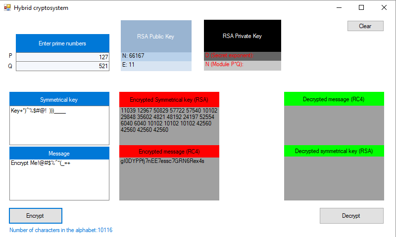

# Hybrid-Cryptosystem

## About

This project implements a combined message encryption system.

## Work screenshots

## Hybrid Cryptosystem Example

### To encrypt a message addressed to Alice in a hybrid cryptosystem, Bob does the following:

1. Obtains Alice's public key.
2. Generates a fresh symmetric key for the data encapsulation scheme.
3. Encrypts the message under the data encapsulation scheme, using the symmetric key just generated.
4. Encrypts the symmetric key under the key encapsulation scheme, using Alice's public key.
5. Sends both of these encryptions to Alice.

### To decrypt this hybrid ciphertext, Alice does the following:

1. Uses her private key to decrypt the symmetric key contained in the key encapsulation segment.
2. Uses this symmetric key to decrypt the message contained in the data encapsulation segment.

## RC4 (Rivest cipher 4 or Ron’s code). Symmetric encryption

Stream cipher widely used in various information security systems in computer networks (for example, in SSL and TLS protocols, wireless network security algorithms WEP and WPA).

### The main advantages of the cipher:

1. high speed;
2. variable key size.

### RC4 is quite vulnerable if:

1. no random or related keys are used;
2. one keystream is used twice.

### Encryption algorithm

1. The function generates a sequence of bits.
2. Then the sequence of bits through the operation "modulo two summation" (xor) is combined with clear text. The result is a cryptogram

### Decryption algorithm.

1. The key bit stream (key stream) is recreated (regenerated).
2. The key bitstream is added using the xor encryption operation. Due to the properties of the operation "xor", the output is the original (unencrypted) text.

## RSA. 

A public key cryptographic algorithm based on the computational complexity of the problem of factoring large integers.

### RSA keys are generated as follows:

1. Two different random primes p and q of a given size are selected.
2. Their product is calculated n = p and q, which is called a module.
3. Calculate the value of the Euler function of the number n:
4. An integer e is selected: 1 <е <f (n) is coprime with the value of the function f (n)
  + The number e is called the open exponent.
  + Usually, e is taken as prime numbers containing a small number of single bits in a binary notation, for example, farm numbers: 17, 257 or 65537, since in this case the time required for encryption using fast exponentiation will be less.
  + Too small e values, such as 3, can potentially weaken the security of an RSA circuit.
5. Calculates the number d, multiplicatively inverse to the number e modulo.
  + The number d is called the secret exponent. It is usually calculated using the advanced Euclidean algorithm.
6. Pair (e, n) is published as RSA public key
7. The pair (d, n) plays the role of the RSA private key and is kept secret.
